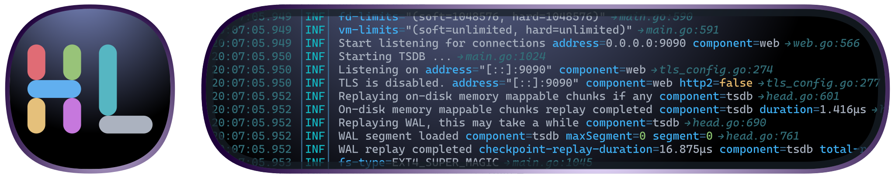
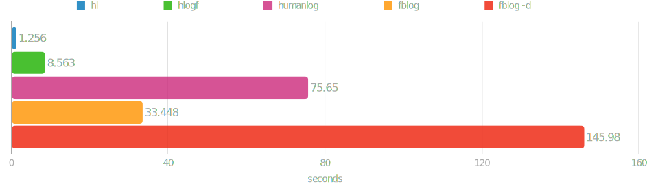

# hl [![Build Status][ci-img]][ci] [![Coverage Status][cov-img]][cov] [![Release][release-img]][release]

[](#screenshot)

High-performance log viewer and processor that transforms logs in JSON and logfmt formats into a human-readable output. Built with efficiency in mind, it enables quick parsing and analysis of large log files with minimal overhead.

## Features overview

* __[Automatic Pager Integration](#automatic-usage-of-pager)__: Automatically integrates with a pager for enhanced convenience, defaulting to [less](https://greenwoodsoftware.com/less/) if available, but fully supporting any compatible pager.
* __Log Streaming Mode__: Enable log streaming with the `-P` flag, which disables the pager.
* __[Field-Based Filtering](#filtering-by-field-values)__: Filter log records by key/value pairs using the `-f` option, with support for hierarchical keys.
* __[Level Filtering](#quick-filtering-by-log-level)__: Easily filter logs by level with the `-l` option.
* __[Timestamp Range Filtering](#filtering-by-time-range)__: Filter logs by timestamp range using the `--since` and `--until` options with intuitive formats:
  * RFC-3339 timestamp format.
  * Current configured timestamp output format (via the `-t` option or environment variable).
  * User-friendly shortcuts like `today`, `yesterday`, `friday`, or relative offsets such as `-3h` or `-14d`.
* __[Field Visibility Control](#hiding-or-revealing-selected-fields)__: Quickly hide or reveal specific fields using the `-h` option.
* __Empty Field Hiding__: Automatically hide empty fields with the `-e` flag.
* __[High-Speed Message Sorting](#sorting-messages-chronologically)__: Achieve lightning-fast message sorting with automatic indexing via the `-s` flag.
  * Performs the initial scan at approximately 2 GiB/s, enabling rapid filtering by timestamp and level without re-scanning.
  * Efficiently handles hundreds of local files totaling hundreds of gigabytes.
  * Reindexes large, growing files at speeds up to roughly 10 GiB/s by skipping unmodified blocks.
* __[Live Follow Mode](#sorting-messages-chronologically-with-following-the-changes)__: Use the `-F` flag for live, timestamp-sorted message updates across multiple sources, with a preview of recent messages via the `--tail` option.
* __[Complex Query Support](#performing-complex-queries)__: Construct custom queries with logical conditions (AND/OR) and additional advanced filtering options.
* __Non-JSON Prefix Handling__: Process logs with non-JSON prefixes using the `--allow-prefix` flag.
* __Timezone Flexibility__: Displays timestamps in UTC by default while allowing effortless timezone switching with the `-Z` option or local timezone adjustments using the `-L` flag.
* __Customizability and Themes__: Fully customizable through [configuration files](#configuration-files) and environment variables, with support for easy [theme switching](#selecting-current-theme) and custom [themes](#custom-themes).

## Performance comparison chart

### Performance comparison with [humanlog](https://github.com/humanlogio/humanlog), [hlogf](https://github.com/ssgreg/hlogf) and [fblog](https://github.com/brocode/fblog) on a 2.3 GiB log file



* See [performance](#performance) section for more details.

## Installation options

### macOS

* Install using [homebrew](https://brew.sh) on macOS

    ```sh
    brew install hl
    ```

<details>
<summary>Other options</summary>

* Download and extract using `curl` and `tar` on macOS

    ```sh
    curl -sSfL https://github.com/pamburus/hl/releases/latest/download/hl-macos.tar.gz | tar xz
    ```

* Install using [cargo](https://www.rust-lang.org/tools/install)

    ```sh
    cargo install --locked --git https://github.com/pamburus/hl.git
    ```

* Download latest release from [download page](https://github.com/pamburus/hl/releases/latest)

</details>

### Linux

* Download and extract using `curl` and `tar` on Linux (x86_64)

    ```sh
    curl -sSfL https://github.com/pamburus/hl/releases/latest/download/hl-linux-x86_64-musl.tar.gz | tar xz
    ```

* Install [hl package](https://archlinux.org/packages/extra/x86_64/hl/) from Arch Linux extra repository

    ```sh
    pacman -S hl
    ```

<details>
<summary>Other options</summary>

* Download and extract using `curl` and `tar` on Linux (arm64/aarch64)

    ```sh
    curl -sSfL https://github.com/pamburus/hl/releases/latest/download/hl-linux-arm64-musl.tar.gz | tar xz
    ```

* Install using [cargo](https://www.rust-lang.org/tools/install)

    ```sh
    cargo install --locked --git https://github.com/pamburus/hl.git
    ```

</details>

### Windows

* Install from [Scoop](https://scoop.sh)

    ```sh
    scoop bucket add pamburus https://github.com/pamburus/scoop-bucket.git
    scoop install hl
    ```

> [!TIP]
> It is recommended to use [Windows Terminal](https://aka.ms/terminal) for better experience.

> [!TIP]
> To make mouse scrolling work in the [less](https://www.greenwoodsoftware.com/less/) pager, set the `LESS` environment variable to `-R --mouse`.

> [!IMPORTANT]
> Currently, `hl` does not provide a built-in pager and relies on external pagers such as [less](https://www.greenwoodsoftware.com/less/).
> However, the [build for Windows]([https://github.com/jftuga/less-Windows]) referenced on the original [download page](https://www.greenwoodsoftware.com/less/download.html) and distributed in the [WinGet](https://winget.run/pkg/jftuga/less) package manager does not work as expected.
> The authors state that they have not tested or verified this build and suggest that you use it at your own risk.
> Unfortunately, this build breaks some ANSI escape sequences and does not work properly with `hl` and many other programs that use ANSI escape sequences for colors and styles.
> It is recommended to install [less](https://www.greenwoodsoftware.com/less/) from the [Scoop](https://scoop.sh) or [Chocolatey](https://chocolatey.org/) package manager.
> If you are using [Scoop](https://scoop.sh) and install `hl` by running `scoop install hl`, it already installs [less](https://www.greenwoodsoftware.com/less/) automatically as a dependency. Just make sure you do not have any other conflicting installations by running `where less` in cmd or `Get-Command less` in powershell.

* Download latest release from [download page](https://github.com/pamburus/hl/releases/latest)

<details>
<summary>Other options</summary>

* Install using [cargo](https://www.rust-lang.org/tools/install)

    ```sh
    cargo install --locked --git https://github.com/pamburus/hl.git
    ```

</details>

### NixOS

* Run using [nix](https://nixos.org/download/)

  ```sh
  nix run github:pamburus/hl
  ```

  or binary package

  ```sh
  nix run github:pamburus/hl#bin
  ```

  or install with [nix profile](https://nix.dev/manual/nix/2.31/command-ref/new-cli/nix3-profile-add):

  ```sh
  nix profile add github:pamburus/hl
  ```

  or binary package

  ```sh
  nix profile add github:pamburus/hl#bin
  ```

* Install the package from source using [nix-flakes](https://wiki.nixos.org/wiki/Flakes)

  <details>
  <summary>Example how to update nix configuration</summary>

  ```nix
  {
    inputs = {
      nixpkgs.url = "github:NixOS/nixpkgs/nixos-25.05";
      hl.url = "github:pamburus/hl";
    };
    outputs = {nixpkgs, hl, ...}:
    let
      system = "x86_64-linux";
    in
    {
      # this is just an example!
      nixosConfigurations.yourHost = nixpkgs.lib.nixosSystem {
        inherit system;
        modules = [
          ({...}: {
            environment.systemPackages = [
              hl.packages.${system}
            ];
          })
        ];
      };
    };
  }
  ```

  </details>

* Install the package with pre-built binaries using [nix-flakes](https://wiki.nixos.org/wiki/Flakes)

  <details>
  <summary>Example how to update nix configuration</summary>

  ```nix
  {
    inputs = {
      nixpkgs.url = "github:NixOS/nixpkgs/nixos-25.05";
      hl.url = "github:pamburus/hl";
    };
    outputs = {nixpkgs, hl, ...}:
    let
      system = "x86_64-linux";
    in
    {
      # this is just an example!
      nixosConfigurations.yourHost = nixpkgs.lib.nixosSystem {
        inherit system;
        modules = [
          ({...}: {
            environment.systemPackages = [
              hl.packages.${system}.bin
            ];
          })
        ];
      };
    };
  }
  ```

  </details>

## Examples

### Screenshot

<p align="center">
    <picture>
    <source media="(prefers-color-scheme: dark)" srcset="https://raw.githubusercontent.com/pamburus/hl-extra/2d956593188617b4c464688caa9456348e648216/screenshot/uni/dark.svg" />
    <source media="(prefers-color-scheme: light)" srcset="https://raw.githubusercontent.com/pamburus/hl-extra/2d956593188617b4c464688caa9456348e648216/screenshot/uni/light.svg" />
    
    </picture>
</p>

See other [screenshots](https://github.com/pamburus/hl-extra/blob/2d956593188617b4c464688caa9456348e648216/screenshot/README.md#current-mode)

## Features and usage

### Concatenation of multiple log files

* Concatenate all log files

    Command

    ```sh
    hl *.log
    ```

    Concatenates and displays all `*.log` files found in the current directory.

### Support for compressed (bzip2, gzip, xz, zstd) log files

* Concatenate all log files including compressed log files

    Command

    ```sh
    hl $(ls -tr /var/log/example/*.{log,log.gz,log.zst,s})
    ```

    Concatenates and displays all `*.log`, `*.log.gz`, `*.log.zst` and `*.s` (will detect compression) files found in `/var/log/example/`.

### Automatic usage of pager

* Use the default pager with the default parameters

    Command

    ```sh
    hl example.log
    ```

    Automatically opens `less` pager with the default parameters.

* Override options for default pager

    Command

    ```sh
    LESS=-SR hl example.log
    ```

    Opens `less` pager with disabled line wrapping.

* Use custom pager

    Command

    ```sh
    PAGER="most -w" hl example.log
    ```

    Opens `most` pager with `-w` option.

### Quick filtering by log level

* Errors only

    Command

    ```sh
    hl -l e
    ```

    Displays only error log level messages.

* Errors and warnings

    Command

    ```sh
    hl -l w
    ```

    Displays only warning and error log level messages.

* Errors, warnings and informational

    Command

    ```sh
    hl -l i
    ```

    Displays all log messages except debug level messages.

### Using live log streaming

* Command

    ```sh
    tail -f example.log | hl -P
    ```

    Tracks changes in the example.log file and displays them immediately.
    Flag `-P` disables automatic using of pager in this case.

### Filtering by field values

* Command

    ```sh
    hl example.log --filter component=tsdb
    ```

    Displays only messages where the `component` field has the value `tsdb`.

* Command

    ```sh
    hl example.log -f component!=tsdb -f component!=uninteresting
    ```

    Displays only messages where the `component` field exists and has a value other than `tsdb` or `uninteresting`.

* Command

    ```sh
    hl example.log -f provider~=string
    ```

    Displays only messages where the `provider` field contains the `string` sub-string.

* Command

    ```sh
    hl example.log -f 'provider!~=string'
    ```

    Displays only messages where the `provider` field exists and does not contain the `string` sub-string.

* Command

    ```sh
    hl example.log -f 'request.method?!=GET'
    ```

    Displays only messages where the `request.method` field does not exist or exists and is not equal to `GET`. In JSON messages, this also matches composite fields, e.g., `{"request":{"method":"POST"}}`.

* Command

    ```sh
    hl example.log -f 'span.[].name=sp0001'
    ```

    Displays only messages where the `span` field is an array that contains an object with a `name` field equal to `sp0001`.

* Command

    ```sh
    hl example.log -f 'span.[1].name=sp0001'
    ```

    Displays only messages where the `span` field is an array with at least two elements, and the element at index 1 (i.e., the second element) is an object with a `name` field equal to `sp0001`.

### Performing complex queries

* Command

    ```sh
    hl my-service.log --query 'level > info or status-code >= 400 or duration > 0.5'
    ```

    Displays messages that either have a level higher than info (i.e. warning or error) or have a status code field with a numeric value >= 400 or a duration field with a numeric value >= 0.5.

* Command

    ```sh
    hl my-service.log -q '(request in (95c72499d9ec, 9697f7aa134f, bc3451d0ad60)) or (method != GET)'
    ```

    Displays all messages that have the 'request' field with one of these values, or the 'method' field with a value other than 'GET'.

* Command

    ```sh
    hl my-service.log -q '.price?=3'
    ```

    Displays messages where the `price` field equals `3` OR the `price` field is absent. The `?` modifier after a field name includes records that don't have that field. Without the `?` modifier, filtering on a missing field will skip the record.

* Command

    ```sh
    hl my-service.log -q '.status?!=error'
    ```

    Displays messages where the `status` field is not equal to `error` OR the `status` field is absent. This is useful to include records that may not have a status field at all.

* Command

    ```sh
    hl my-service.log -q 'exists(.price)'
    ```

    Displays only messages that have the `price` field, regardless of its value. The `exists()` operator tests for field presence without any value comparison.

* Command

    ```sh
    hl my-service.log -q 'exists(msg) and msg~=warning'
    ```

    Displays messages that have a `msg` field that exists AND contains the substring `warning`. This combines field existence checking with value matching.

* Command

    ```sh
    hl my-service.log -q 'not exists(.internal)'
    ```

    Displays messages that do NOT have an `internal` field, effectively filtering out records with that field.

* Complete set of supported operators

  * Logical operators
    * Logical conjunction - `and`, `&&`
    * Logical disjunction - `or`, `||`
    * Logical negation - `not`, `!`
  * Comparison operators
    * Equal - `eq`, `=`
    * Not equal - `ne`, `!=`
    * Greater than - `gt`, `>`
    * Greater or equal - `ge`, `>=`
    * Less than - `lt`, `<`
    * Less or equal - `le`, `<=`
  * String matching operators
    * Sub-string check - (`contain`, `~=`), (`not contain`, `!~=`)
    * Wildcard match - (`like`), (`not like`)
      * Wildcard characters are: `*` for zero or more characters and `?` for a single character
    * Regular expression match - (`match`, `~~=`), (`not match`, `!~~=`)
  * Operators with sets
    * Test if a value is one of the values in a set - `in (v1, v2)`, `not in (v1, v2)`
    * Test if a value is one of the values in a set loaded from a file - `in @filename`, `not in @filename`, assuming that each element is a line in the file, which can be either a simple string or a JSON string
    * Test if a value is one of the values in a set loaded from stdin - `in @-`, `not in @-`
  * Field existence operators
    * Test if a field exists - `exists(.field)` or `exist(.field)` (both forms are supported)

* Notes

  * __Include Absent Modifier (`?`)__: When appending `?` to a field name (e.g., `.field?=value`), the filter will match both:
    * Records where the field exists and matches the condition
    * Records where the field is absent (does not exist)

    This is useful in logfmt or similar formats where fields may be optional. Without the `?` modifier, records with a non-existent field are excluded from the results.

  * Special field names that are reserved for filtering by predefined fields regardless of the actual source field names used to load the corresponding value: `level`, `message`, `caller` and `logger`.
  * To address a source field with one of these names instead of predefined fields, add a period before its name, i.e., `.level` will perform a match against the "level" source field.
  * To address a source field by its exact name, use a JSON-formatted string, i.e. `-q '".level" = info'`.
  * To specify special characters in field values, also use a JSON-formatted string, i.e.

    ```sh
    hl my-service.log -q 'message contain "Error:\nSomething unexpected happened"'
    ```

### Filtering by time range

* Command

    ```sh
    hl example.log --since 'Jun 19 11:22:33' --until yesterday
    ```

    Displays only messages that occurred after Jun 19 11:22:33 UTC of the current year (or the previous year if the current date is less than Jun 19 11:22:33) and before yesterday midnight.

* Command

    ```sh
    hl example.log --since -3d
    ```

    Displays only messages from the past 72 hours.

* Command

    ```sh
    hl example.log --until '2021-06-01 18:00:00' --local
    ```

    Displays only messages that occurred before 6 PM local time on June 1, 2021, and shows timestamps in local time.

### Hiding or revealing selected fields

* Command

    ```sh
    hl example.log --hide provider
    ```

    Hides field `provider`.

* Command

    ```sh
    hl example.log --hide '*' --hide '!provider'
    ```

    Hides all fields except `provider`.

* Command

    ```sh
    hl example.log -h headers -h body -h '!headers.content-type'
    ```

    Hides fields `headers` and `body` but shows a single sub-field `content-type` inside field `headers`.

### Sorting messages chronologically

* Command

    ```sh
    hl -s *.log
    ```

    Displays log messages from all log files in the current directory sorted in chronological order.

### Sorting messages chronologically with following the changes

* Command

    ```sh
    hl --sync-interval-ms 500 -F <(kubectl logs -l app=my-app-1 -f) <(kubectl logs -l app=my-app-2 -f)
    ```

    Runs without a pager in follow mode by merging messages from the outputs of these 2 commands and sorting them chronologically within a custom 500ms interval.

* Command

    ```sh
    hl -F --tail 100 app1.log app2.log app3.log
    ```

    Runs without a pager in follow mode, following the changes in three log files in the current directory and sorting them chronologically at a default interval of 100ms.
    Preloads 100 lines from the end of each file before filtering.

### Configuration files

* Configuration files are automatically loaded if found in predefined platform-specific locations.

    | OS      | System-Wide Location                     | User Profile Location                                    |
    | ------- | ---------------------------------------- |  ------------------------------------------------------- |
    | macOS   | /etc/hl/config.{yaml,toml,json}          | ~/.config/hl/config.{yaml,toml,json}                     |
    | Linux   | /etc/hl/config.{yaml,toml,json}          | ~/.config/hl/config.{yaml,toml,json}                     |
    | Windows | %PROGRAMDATA%\hl\config.{yaml,toml,json} | %USERPROFILE%\AppData\Roaming\hl\config.{yaml,toml,json} |

* The path to the configuration file can be overridden using the `HL_CONFIG` environment variable or the `--config` command-line option.

    The order in which the configuration files are searched and loaded is as follows:
    1. __The system-wide location.__
    2. __The user profile location.__
    3. __The location specified by the `HL_CONFIG` environment variable__ (unless the `--config` option is used).
    4. __The locations specified by the `--config` option__ (can be specified multiple times).

    If a configuration file is found in multiple locations, the file in each subsequent location overrides only the parameters it contains.

    If `HL_CONFIG` or `--config` specifies `-` or an empty string, all default locations and any locations specified by previous `--config` options are discarded. The search for the configuration file locations starts over.

    To disable loading of configuration files and use the built-in defaults, `--config -` can be used.

* All parameters in the configuration file are optional and can be omitted. In this case, default values are used.

#### Default configuration file

* [config.yaml](etc/defaults/config.yaml)

### Environment variables

* Many parameters that are defined in command line arguments and configuration files can also be specified by environment variables.

#### Precedence of configuration sources (from lowest priority to highest priority)

* Configuration file
* Environment variables
* Command-line arguments

#### Environment variables examples

* `HL_TIME_FORMAT='%y-%m-%d %T.%3N'` overrides the time format specified in the configuration file.
* `HL_TIME_ZONE=Europe/Berlin` overrides the time zone specified in the configuration file.
* `HL_CONCURRENCY=4` overrides the concurrency limit specified in the configuration file.
* `HL_PAGING=never` specifies the default value for the paging option, but it can be overridden by command line arguments.

### Themes

#### Stock themes

* [themes](etc/defaults/themes/)

#### Selecting current theme

* Using `theme` value in the configuration file.
* Using environment variable, i.e. `HL_THEME=classic`, overrides the value specified in configuration file.
* Using command-line argument, i.e. `--theme classic`, overrides all other values.

#### Selecting themes with preview

To select themes with preview [fzf](https://github.com/junegunn/fzf) tool can be used like this:

```bash
hl --list-themes | fzf --color='bg+:23,gutter:-1,pointer:210' --highlight-line --preview-window 'right,border-left,88%,<142(up,88%,border-bottom)' --preview="hl -t '%b %d %T' --input-info minimal -c --theme {} sample/*.log"
```

#### Custom themes

* Custom themes are automatically loaded when found in a predefined platform-specific location.

    | OS      | Location                                                   |
    | ------- | ---------------------------------------------------------- |
    | macOS   | ~/.config/hl/themes/*.{yaml,toml,json}                     |
    | Linux   | ~/.config/hl/themes/*.{yaml,toml,json}                     |
    | Windows | %USERPROFILE%\AppData\Roaming\hl\themes\*.{yaml,toml,json} |

* Format description
  * Section `elements` contains styles for predefined elements.
  * Section `levels` contains optional overrides for styles defined in `elements` sections per logging level, which are [`trace`, `debug`, `info`, `warning`, `error`].
  * Each element style contains optional `background`, `foreground` and `modes` parameters.
  * Example

    ```yaml
    elements:
        <element>:
            foreground: <color>
            background: <color>
            modes: [<mode>, <mode>, ...]
    levels:
        <level>:
            <element>:
                foreground: <color>
                background: <color>
                modes: [<mode>, <mode>, ...]
    ```

  * Color format is one of
    * Keyword `default` specifies default color defined by the terminal.
    * ASCII basic color name, one of
      * `black`
      * `red`
      * `green`
      * `yellow`
      * `blue`
      * `magenta`
      * `cyan`
      * `white`
      * `bright-black`
      * `bright-red`
      * `bright-green`
      * `bright-yellow`
      * `bright-blue`
      * `bright-magenta`
      * `bright-cyan`
      * `bright-white`
    * 256-color palette code, from `0` to `255`.
    * RGB color in hex web color format, i.e. `#FFFF00` for bright yellow color.
  * Modes is a list of additional styles, each of them is one of
    * `bold`
    * `faint`
    * `italic`
    * `underline`
    * `slow-blink`
    * `rapid-blink`
    * `reverse`
    * `conceal`
    * `crossed-out`

### Used terminal color schemes

#### iTerm2

* [One Dark Neo](https://gist.github.com/pamburus/0ad130f2af9ab03a97f2a9f7b4f18c68/746ca7103726d43b767f2111799d3cb5ec08adbb)
* Built-in "Light Background" color scheme

#### Alacritty

* [One Dark Neo](https://gist.github.com/pamburus/e27ebf60aa17d126f5c879f06112edd6/a1e66d34a65b883f1cb8ec28820cc0c53233e3aa#file-alacritty-yml-L904)
  * Note: It is recommended to use `draw_bold_text_with_bright_colors: true` setting
* [Light](https://gist.github.com/pamburus/e27ebf60aa17d126f5c879f06112edd6/a1e66d34a65b883f1cb8ec28820cc0c53233e3aa#file-alacritty-yml-L875)
  * Note: It is recommended to use `draw_bold_text_with_bright_colors: false` setting

### Complete set of options and flags

```text
JSON and logfmt log converter to human readable representation

Usage: hl [OPTIONS] [FILE]...

Arguments:
  [FILE]...  Files to process

Options:
      --config <FILE>                    Configuration file path [env: HL_CONFIG=]
  -s, --sort                             Sort entries chronologically
  -F, --follow                           Follow input streams and sort entries chronologically within time frame set by --sync-interval-ms option
      --tail <N>                         Number of last entries to preload from each file in --follow mode [default: 10]
      --sync-interval-ms <MILLISECONDS>  Synchronization interval for live streaming mode enabled by --follow option [default: 100]
      --paging <WHEN>                    Control pager usage (HL_PAGER or PAGER) [env: HL_PAGING=] [default: auto] [possible values: auto, always, never]
  -P                                     Handful alias for --paging=never, overrides --paging option
      --help[=<VERBOSITY>]               Print help [possible values: short, long]
  -V, --version                          Print version

Filtering Options:
  -l, --level <LEVEL>    Display entries with level >= <LEVEL> [env: HL_LEVEL=]
      --since <TIME>     Display entries with timestamp >= <TIME>
      --until <TIME>     Display entries with timestamp <= <TIME>
  -f, --filter <FILTER>  Filter entries by field values [k=v, k~=v, k~~=v, 'k!=v', 'k?!=v', etc]
  -q, --query <QUERY>    Filter entries using query expression ['status>=400 or duration>=15', etc]

Output Options:
      --color [<WHEN>]        Whether to use ANSI colors and styles [env: HL_COLOR=] [default: auto] [possible values: auto, always, never]
  -c                          Handful alias for --color=always, overrides --color option
      --theme <THEME>         Color theme [env: HL_THEME=] [default: uni]
  -r, --raw                   Output raw source entries instead of formatted entries
      --no-raw                Disable raw source entries output, overrides --raw option
      --raw-fields            Output field values as is, without unescaping or prettifying
  -h, --hide <KEY>            Hide or reveal fields with the specified keys, prefix with ! to reveal, provide '!*' to reveal all
      --flatten <WHEN>        Whether to flatten objects [env: HL_FLATTEN=] [default: always] [possible values: never, always]
  -t, --time-format <FORMAT>  Time format, see https://man7.org/linux/man-pages/man1/date.1.html [env: HL_TIME_FORMAT=] [default: "%b %d %T.%3N"]
  -Z, --time-zone <TZ>        Time zone name, see column "TZ identifier" at https://en.wikipedia.org/wiki/List_of_tz_database_time_zones [env: HL_TIME_ZONE=] [default: UTC]
  -L, --local                 Use local time zone, overrides --time-zone option
      --no-local              Disable local time zone, overrides --local option
  -e, --hide-empty-fields     Hide empty fields, applies for null, string, object and array fields only [env: HL_HIDE_EMPTY_FIELDS=]
  -E, --show-empty-fields     Show empty fields, overrides --hide-empty-fields option [env: HL_SHOW_EMPTY_FIELDS=]
      --input-info <LAYOUTS>  Input number and filename layouts [default: auto] [possible values: auto, none, minimal, compact, full]
      --ascii [<WHEN>]        Whether to restrict punctuation to ASCII characters only [env: HL_ASCII=] [default: auto] [possible values: auto, never, always]
  -o, --output <FILE>         Output file

Input Options:
      --input-format <FORMAT>       Input format [env: HL_INPUT_FORMAT=] [default: auto] [possible values: auto, json, logfmt]
      --unix-timestamp-unit <UNIT>  Unix timestamp unit [env: HL_UNIX_TIMESTAMP_UNIT=] [default: auto] [possible values: auto, s, ms, us, ns]
      --allow-prefix                Allow non-JSON prefixes before JSON log entries [env: HL_ALLOW_PREFIX=]
      --delimiter <DELIMITER>       Log entry delimiter [NUL, CR, LF, CRLF] or any custom string

Advanced Options:
      --interrupt-ignore-count <N>  Number of interrupts to ignore, i.e. Ctrl-C (SIGINT) [env: HL_INTERRUPT_IGNORE_COUNT=] [default: 3]
      --buffer-size <SIZE>          Buffer size [env: HL_BUFFER_SIZE=] [default: "256 KiB"]
      --max-message-size <SIZE>     Maximum log entry size [env: HL_MAX_MESSAGE_SIZE=] [default: "64 MiB"]
  -C, --concurrency <N>             Number of processing threads [env: HL_CONCURRENCY=]
      --shell-completions <SHELL>   Print shell auto-completion script and exit [possible values: bash, elvish, fish, powershell, zsh]
      --man-page                    Print man page and exit
      --list-themes[=<TAGS>]        Print available themes optionally filtered by tags [possible values: dark, light, 16color, 256color, truecolor]
      --dump-index                  Print debug index metadata (in --sort mode) and exit
```

## Performance


* MacBook Pro (16-inch, 2021)
  * __CPU__:   Apple M1 Max CPU
  * __OS__:    macOS Sequoia 15.2
  * __Data__:  ~ __2.3 GiB__ log file, __6 000 000__ lines
    * [hl](https://github.com/pamburus/hl) __v0.30.2__ ~ *1.1 seconds*

        ```sh
        $ time hl --config - example.log -c -o /dev/null
        hl --config - example.log -c -o /dev/null  9.80s user 0.61s system 915% cpu 1.138 total
        ```

    * [hlogf](https://github.com/ssgreg/hlogf) __v1.4.1__ ~ *8.7 seconds*

        ```sh
        $ time hlogf example.log --color always >/dev/null
        hlogf example.log --color always > /dev/null  6.85s user 1.94s system 100% cpu 8.738 total
        ```

    * [humanlog](https://github.com/humanlogio/humanlog) __v0.7.8__ ~ *79 seconds*

        ```sh
        $ time humanlog <example.log --color always >/dev/null
        humanlog> reading stdin...
        humanlog --color always < example.log > /dev/null  87.68s user 7.33s system 120% cpu 1:19.01 total
        ```

    * [fblog](https://github.com/brocode/fblog) __v4.13.1__ ~ *34 seconds*

        ```sh
        $ time fblog example.log >/dev/null
        fblog example.log > /dev/null  31.32s user 2.22s system 99% cpu 33.553 total
        ```

    * [fblog](https://github.com/brocode/fblog) with `-d` flag __v4.13.1__ ~ *146 seconds*

        ```sh
        $ time fblog -d example.log >/dev/null
        fblog -d example.log > /dev/null  131.88s user 14.55s system 99% cpu 2:26.45 total
        ```

  * See [#132](https://github.com/pamburus/hl/issues/132) for how to repeat measurements

[ci-img]: https://github.com/pamburus/hl/actions/workflows/ci.yml/badge.svg
[ci]: https://github.com/pamburus/hl/actions/workflows/ci.yml
[cov-img]: https://codecov.io/gh/pamburus/hl/graph/badge.svg?token=464MN13408
[cov]: https://codecov.io/gh/pamburus/hl
[release-img]: https://img.shields.io/github/v/release/pamburus/hl?sort=semver
[release]: https://github.com/pamburus/hl/releases/latest
