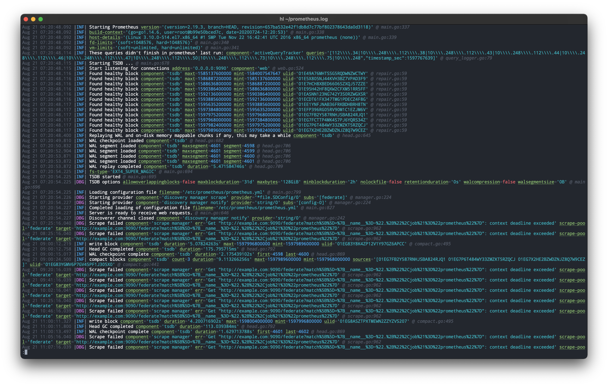
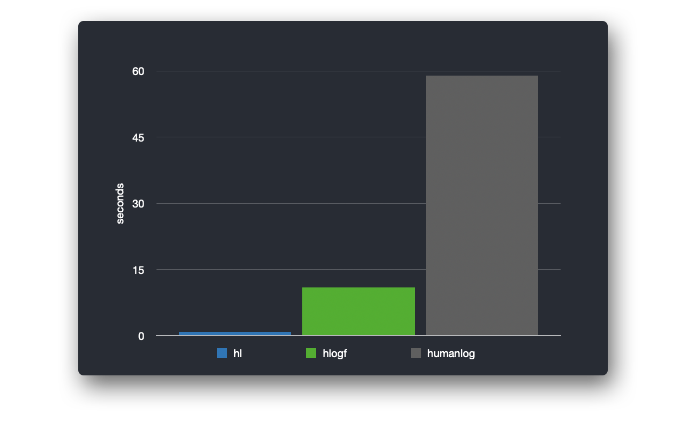

# hl
Log viewer which translates JSON logs into pretty human-readable representation. It is a faster alternative to [humanlog](https://github.com/aybabtme/humanlog) and [hlogf](https://github.com/ssgreg/hlogf) with several additional features.

## Installation options

* Download latest release from [download page](https://github.com/pamburus/hl/releases/latest)

* Download and extract using `curl` and `tar` on Linux

    ```
    curl -sSfL https://github.com/pamburus/hl/releases/latest/download/hl-linux.tar.gz | tar xz
    ```

* Download and extract using `curl` and `tar` on macOS

    ```
    curl -sSfL https://github.com/pamburus/hl/releases/latest/download/hl-macos.tar.gz | tar xz
    ```

## Examples

### Screenshot



## Features and usage

### Concatenation of multiple log files

- Concatenate all log files

    Command

    ```
    $ hl $(ls -tr /var/log/example/*.log)
    ```
    Concatenates and humanizes all `*.log` files found in `/var/log/example/`.

### Support for gzipped log files

- Concatenate all log files including gzipped log files

    Command

    ```
    $ hl $(ls -tr /var/log/example/*.{log,log.gz})
    ```
    Concatenates and humanizes all `*.log` and `*.log.gz` files found in `/var/log/example/`.

### Automatic usage of pager

- Use default pager with default parameters

    Command

    ```
    $ hl example.log
    ```
    Automatically opens `less` pager with default parameters.

- Override options for default pager
    
    Command

    ```
    $ LESS=-SR hl example.log
    ```
    Opens `less` pager with disabled line wrapping.

- Use custom pager
    
    Command

    ```
    $ PAGER=bat hl example.log
    ```
    Opens `bat` pager.

### Quick filtering by log level

- Errors only

    Command 

    ```
    $ hl -l e
    ```

    Shows only messages with error log level.

- Errors and warnings

    Command 

    ```
    $ hl -l w
    ```
    Shows only messages with warning and error log level.

- Errors, warnings and informational

    Command 

    ```
    $ hl -l i
    ```
    Shows all log messages except debug level messages.

### Using live log streaming

- Command

    ```
    $ tail -f example.log | hl -P
    ```
    Follows changes in example.log file and displays them immediately.
    Flag `-P` disables automatic using of pager in this case.


### Filtering by field values

- Command

    ```
    $ hl example.log -f component=tsdb
    ```
    Shows only messages with field `component` having value `tsdb`.

- Command

    ```
    $ hl example.log -f component!=tsdb -f component!=uninteresting
    ```
    Shows only messages with field `component` having value other than `tsdb` or `uninteresting`.

- Command

    ```
    $ hl example.log -f provider~=string
    ```
    Shows only messages with field `provider` containing sub-string `string`.


### Filtering by time range

- Command

    ```
    $ hl example.log --since 'Jun 19 11:22:33' --until yesterday
    ```
    Shows only messages occurred after Jun 19 11:22:33 UTC of the current year (or of the previous one if current date is less than Jun 19 11:22:33) and until yesterday midnight.

- Command

    ```
    $ hl example.log --since -3d
    ```
    Shows only messages for the last 72 hours.

- Command

    ```
    $ hl example.log --until '2021-06-01 18:00:00' --local
    ```
    Shows only messages occurred before 6 PM on 1st Jun 2021 in local time as well as show timestamps in local time.


### Hiding or showing selected fields

- Command

    ```
    $ hl example.log --hide provider
    ```
    Hides field `provider`.


- Command

    ```
    $ hl example.log --show provider
    ```
    Hides all fields except `provider`.


- Command

    ```
    $ hl example.log -h headers -h body -H headers.content-type
    ```
    Hides fields `headers` and `body` but shows a single sub-field `content-type` inside field `headers`.


### Configuration files

- Configuration file is loaded automatically if found at predefined platform-specific location.

    | OS      | Location                                      |
    | ------- | --------------------------------------------- | 
    | macOS   | ~/.config/hl/config.yaml                      |
    | Linux   | ~/.config/hl/config.yaml                      |
    | Windows | %USERPROFILE%\AppData\Roaming\hl\config.yaml  |

- Any parameters in the configuration file are optional and may be omitted. In this case default values will be used.

#### Default configuration file

- [config.yaml](etc/defaults/config.yaml)


### Envrionment variables

- Many parameters which are defined in command-line arguments and configuration files may be specified by envrionment variables also.

#### Precedence of configuraton sources
* Configuration file
* Environment variables
* Command-line arguments

#### Examples
* `HL_TIME_FORMAT='%y-%m-%d %T.%3N'` overrides time format specified in configuration file.
* `HL_TIME_ZONE=Europe/Moscow` overrides time zone specified in configuration file.
* `HL_CONCURRENCY=4` overrides concurrency limit specified in configuration file.
* `HL_PAGING=never` specified default value for paging option but it may be overriden by command-line arguments.


### Themes

#### Stock themes
- [themes](etc/defaults/themes/)

#### Selecting current theme
* Using `theme` value in the configuration file.
* Using environment variable, i.e. `HL_THEME=classic`, overrides the value specified in configuration file.
* Using command-line argument, i.e. `--theme classic`, overrides all other values.

#### Custom themes
- Custom themes are loaded automatically if found at predefined platform-specific location.

    | OS      | Location                                       |
    | ------- | ---------------------------------------------- | 
    | macOS   | ~/.config/hl/themes/*.yaml                     |
    | Linux   | ~/.config/hl/themes/*.yaml                     |
    | Windows | %USERPROFILE%\AppData\Roaming\hl\themes\*.yaml |

- Format description
  - Section `elements` contains styles for predefined elements.
  - Section `levels` contains optional overrides for styles defined in `elements` sections per logging level, which are [`debug`, `info`, `warning`, `error`].
  - Each element style contains optional `background`, `foreground` and `modes` parameters.
  - Example
    ```yaml
    elements:
        <element>:
            foreground: <color>
            background: <color>
            modes: [<mode>, <mode>, ...]
    levels:
        <level>:
            <element>:
                foreground: <color>
                background: <color>
                modes: [<mode>, <mode>, ...]
    ```
  - Color format is one of
    - Keyword `default` specifies default color defined by the terminal.
    - ASCII basic color name, one of
      - `black`
      - `red`
      - `green`
      - `yellow`
      - `blue`
      - `magenta`
      - `cyan`
      - `white`
      - `bright-black`
      - `bright-red`
      - `bright-green`
      - `bright-yellow`
      - `bright-blue`
      - `bright-magenta`
      - `bright-cyan`
      - `bright-white`
    - 256-color palette code, from `0` to `255`.
    - RGB color in hex web color format, i.e. `#FFFF00` for bright yellow color.
  - Modes is a list of additional styles, each of them is one of
    - `bold`
    - `faint`
    - `italic`
    - `underline`
    - `slow-blink`
    - `rapid-blink`
    - `reverse`
    - `conseal`
    - `crossed-out`


### Complete set of options and flags

```
hl 0.10.3
JSON log converter to human readable representation

USAGE:
    hl [FLAGS] [OPTIONS] [--] [FILE]...

FLAGS:
    -c                   Handful alias for --color=always, overrides --color option
        --help           Prints help information
        --list-themes    List available themes and exit
    -L, --local          Use local time zone, overrides --time-zone option
    -P                   Handful alias for --paging=never, overrides --paging option
    -r, --raw-fields     Disable unescaping and prettifying of field values
    -V, --version        Prints version information

OPTIONS:
        --buffer-size <buffer-size>                          Buffer size [env: HL_BUFFER_SIZE=]  [default: 2 MiB]
        --color <color>                                      Color output options, one of { auto, always, never } [env: HL_COLOR=]  [default: auto]
    -C, --concurrency <concurrency>                          Number of processing threads [env: HL_CONCURRENCY=]
    -f, --filter <filter>...                                 Filtering by field values in one of forms [<key>=<value>, <key>~=<value>, <key>~~=<value>, <key>!=<value>, <key>!~=<value>, <key>!~~=<value>] where ~ denotes substring match and ~~ denotes regular expression match
    -h, --hide <hide>...                                     Hide fields with the specified keys
    -e, --hide-empty-fields <hide-empty-fields>              Hide empty fields, applies for null, string, object and array fields only [env: HL_HIDE_EMPTY_FIELDS=]
        --interrupt-ignore-count <interrupt-ignore-count>    Number of interrupts to ignore, i.e. Ctrl-C (SIGINT) [env: HL_INTERRUPT_IGNORE_COUNT=]  [default: 3]
    -l, --level <level>                                      Filtering by level, one of { d[ebug], i[nfo], w[arning], e[rror] } [env: HL_LEVEL=]
        --max-message-size <max-message-size>                Maximum message size [env: HL_MAX_MESSAGE_SIZE=]  [default: 64 MiB]
        --paging <paging>                                    Output paging options, one of { auto, always, never } [env: HL_PAGING=]  [default: auto]
    -H, --show <show>...                                     Hide all fields except fields with the specified keys
    -E, --show-empty-fields <show-empty-fields>              Show empty fields, overrides --hide-empty-fields option [env: HL_SHOW_EMPTY_FIELDS=]
        --since <since>                                      Filtering by timestamp >= the value (--time-zone and --local options are honored)
        --theme <theme>                                      Color theme [env: HL_THEME=]  [default: one-dark-green]
    -t, --time-format <time-format>                          Time format, see https://man7.org/linux/man-pages/man1/date.1.html [env: HL_TIME_FORMAT=]  [default: %b %d %T.%3N]
    -Z, --time-zone <time-zone>                              Time zone name, see column "TZ database name" at https://en.wikipedia.org/wiki/List_of_tz_database_time_zones [env: HL_TIME_ZONE=]  [default: UTC]
    -u, --unhide <unhide>...                                 Unhide fields with the specified keys
        --until <until>                                      Filtering by timestamp <= the value (--time-zone and --local options are honored)

ARGS:
    <FILE>...    Files to process
```

## Performance

* MacBook Pro (16-inch, 2019)
    * CPU - 2,4 GHz 8-Core Intel Core i9
    * OS - macOS 10.15.6
    * Data - ~1GiB log file, 4.150.000 lines
        * hl v0.6.8 ~ 1 second
            ```
            $ time hl prom-m2.log -c >/dev/null
            hl prom-m2.log -c > /dev/null  12.41s user 0.64s system 1430% cpu 0.912 total
            ```
        * hlogf v1.4.1 ~ 10 seconds
            ```
            $ time hlogf prom-m2.log --color= >/dev/null
            hlogf prom-m2.log --color= > /dev/null  9.91s user 1.22s system 101% cpu 10.970 total
            ```
        * humanlog v0.4.1 ~ 60 seconds
            ```
            $ time humanlog <prom-m2.log >/dev/null
            humanlog> reading stdin...
            humanlog < prom-m2.log > /dev/null  58.55s user 4.89s system 107% cpu 58.931 total
            ```
        

## Future features

- Optional sorting of log messages by timestamp
