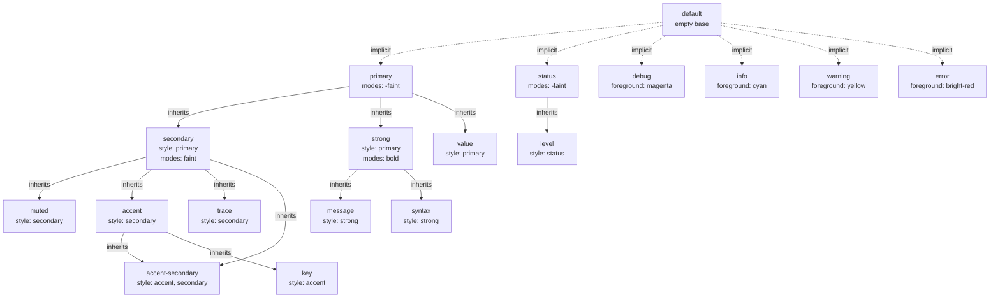

# Theme Configuration Reference (v1.0)

## Table of Contents

- [Overview](#overview)
- [Theme Structure](#theme-structure)
- [Style Inheritance](#style-inheritance)
- [Sections](#sections)
  - [Version](#version)
  - [Tags](#tags)
  - [Styles](#styles)
  - [Elements](#elements)
  - [Levels](#levels)
  - [Indicators](#indicators)
- [Property Reference](#property-reference)
  - [Colors](#colors)
  - [Modes](#modes)
  - [Style Field](#style-field)
- [Advanced Topics](#advanced-topics)
  - [Inheritance Resolution](#inheritance-resolution)
  - [Mode Operations](#mode-operations)
  - [Multiple Inheritance](#multiple-inheritance)
  - [Parent-Inner Elements](#parent-inner-elements)
- [Complete Examples](#complete-examples)
- [Migration from v0](#migration-from-v0)

## Overview

Theme configuration v1.0 introduces role-based styling with inheritance, making themes more maintainable and consistent. All themes automatically inherit from a built-in `@base` theme that provides sensible defaults.

**Key Features:**
- **Role-based styling**: Define reusable styles
- **Inheritance**: Styles and elements can inherit from other styles
- **Mode operations**: Add/remove modes instead of replacing
- **Multiple inheritance**: Merge properties from multiple parent roles
- **Built-in defaults**: All undefined styles fall back to `@base` theme

**Supported Formats:**
- TOML (`.toml`) - Recommended
- YAML (`.yaml`, `.yml`)
- JSON (`.json`)

**Theme Locations:**

| OS      | Location                                                   |
|---------|-----------------------------------------------------------|
| macOS   | `~/.config/hl/themes/*.{toml,yaml,yml,json}`             |
| Linux   | `~/.config/hl/themes/*.{toml,yaml,yml,json}`             |
| Windows | `%USERPROFILE%\AppData\Roaming\hl\themes\*.{toml,yaml,yml,json}` |

## Theme Structure

A v1 theme consists of six sections:

```toml
version = "1.0"                    # Required: Theme version
tags = ["dark", "256color"]        # Optional: Theme metadata

[styles]                           # Optional: Reusable style definitions
# Define reusable styles with role names as keys

[elements]                         # Optional: Element-specific styles
# Override default element styles

[levels]                          # Optional: Per-level element overrides
# Override element styles for specific log levels

[indicators]                      # Optional: Status indicator styles
# Define indicator appearance
```

### Minimal Valid Theme

The simplest valid v1 theme:

```toml
version = "1.0"
```

This theme inherits everything from `@base`.

## Style Inheritance

Styles in the `@base` theme form an inheritance hierarchy. By default, all custom themes inherit these relationships:




**You can override any style's inheritance** using the `style` property. For example, to make `warning` inherit from `error`:

```toml
[styles.warning]
style = "error"
foreground = "yellow"  # Override error's red with yellow
```

## Sections

### Version

**Required.** Must be `"1.0"`.

```toml
version = "1.0"
```

### Tags

**Optional.** Theme classification metadata.

```toml
tags = ["dark", "256color"]
```

**Available tags:**
- `dark` - Dark theme
- `light` - Light theme
- `16color` - Optimized for 16-color terminals
- `256color` - Optimized for 256-color terminals
- `truecolor` - Optimized for 24-bit color terminals

Tags can be combined (e.g., `["dark", "light"]` means compatible with both).

### Styles

**Optional.** Define reusable styles with role names as keys.

**All 18 predefined role names:**

| Role Name | Default Purpose |
|------|----------------|
| `default` | Implicit base for all roles |
| `primary` | Main content styling |
| `secondary` | Secondary/dimmed content |
| `strong` | Emphasized content |
| `muted` | De-emphasized content |
| `accent` | Highlighted content |
| `accent-secondary` | Secondary highlights |
| `message` | Log message text |
| `key` | Key names in key-value pairs |
| `value` | Values in key-value pairs |
| `syntax` | Syntax elements (arrays, objects) |
| `status` | Status indicators |
| `level` | Log level styling |
| `trace` | Trace level specific |
| `debug` | Debug level specific |
| `info` | Info level specific |
| `warning` | Warning level specific |
| `error` | Error level specific |

**Example:**

```toml
[styles]
primary = { foreground = "#E0E0E0", modes = ["-faint"] }
secondary = { style = "primary", modes = ["faint"] }
warning = { style = "primary", foreground = "yellow", modes = ["bold"] }
error = { style = "primary", foreground = "bright-red", modes = ["bold"] }
```

### Elements

**Optional.** Define styles for specific log elements.

**All 28 predefined elements:**

| Category | Elements |
|----------|----------|
| **Input** | `input`, `input-number`, `input-number-inner`, `input-name`, `input-name-inner` |
| **Metadata** | `time`, `level`, `level-inner`, `logger`, `logger-inner`, `caller`, `caller-inner` |
| **Message** | `message`, `message-delimiter`, `field`, `key`, `ellipsis` |
| **Values** | `array`, `object`, `string`, `number`, `boolean`, `boolean-true`, `boolean-false`, `null` |

**Example:**

```toml
[elements]
message = { style = "primary", modes = ["bold"] }
time = { style = "secondary" }
level-inner = { style = "level" }
key = { style = "accent", modes = ["italic"] }
string = { style = "value", foreground = "#98C379" }
```

### Levels

**Optional.** Override element styles for specific log levels.

**Available levels:** `trace`, `debug`, `info`, `warning`, `error`

**Example:**

```toml
[levels.warning]
level-inner = { style = ["level", "warning"] }
message = { style = ["message", "warning"] }

[levels.error]
level-inner = { style = ["level", "error"], modes = ["reverse"] }
message = { style = ["message", "error"] }
time = { style = "error" }  # Even time gets error color
```

### Indicators

**Optional.** Define styles for status indicators (used with `--follow` mode).

```toml
[indicators.sync]
synced = { text = " " }
failed = { 
  text = "!", 
  inner.style = { style = ["status", "warning"], modes = ["bold"] } 
}
```

**Structure:**
- `text` - The indicator character/text
- `outer.prefix` - Text before outer wrapper
- `outer.suffix` - Text after outer wrapper
- `outer.style` - Style for outer wrapper
- `inner.prefix` - Text before inner wrapper
- `inner.suffix` - Text after inner wrapper
- `inner.style` - Style for inner wrapper

## Property Reference

### Colors

**Three formats supported:**

#### 1. ANSI Basic Colors

Named colors (case-sensitive):

```toml
foreground = "red"
background = "bright-white"
```

Available: `default`, `black`, `red`, `green`, `yellow`, `blue`, `magenta`, `cyan`, `white`, `bright-black`, `bright-red`, `bright-green`, `bright-yellow`, `bright-blue`, `bright-magenta`, `bright-cyan`, `bright-white`

#### 2. ANSI Extended (256-color palette)

Integer from 0-255:

```toml
foreground = 139      # Tan
background = 235      # Dark gray
```

#### 3. RGB (True color)

Hex format `#RRGGBB`:

```toml
foreground = "#E5C07B"
background = "#282C34"
```

**Note:** Hex letters (A-F) are case-insensitive.

### Modes

Text rendering modes (case-sensitive):

- `bold` - Bold text
- `faint` - Dimmed text
- `italic` - Italic text
- `underline` - Underlined text
- `slow-blink` - Slow blinking
- `rapid-blink` - Rapid blinking
- `reverse` - Reversed colors
- `conceal` - Hidden text
- `crossed-out` - Strikethrough

#### Mode Operations (v1 feature)

**Add mode:**
```toml
modes = ["bold"]           # Same as ["+bold"]
modes = ["+bold"]          # Explicit add
```

**Remove inherited mode:**
```toml
modes = ["-faint"]         # Remove faint mode
```

**Combine operations:**
```toml
modes = ["-faint", "bold", "italic"]  # Remove faint, add bold and italic
```

**Conflict resolution** (last occurrence wins):
```toml
modes = ["+bold", "-bold"]    # Bold is removed
modes = ["-bold", "+bold"]    # Bold is added
```

### Style Field

Reference one or more parent styles (by role name) for inheritance.

**Single inheritance:**
```toml
[styles.warning]
style = "primary"
foreground = "yellow"
```

**Multiple inheritance:**
```toml
[styles.accent-secondary]
style = ["accent", "secondary"]
```

When multiple role names are listed, properties are merged left-to-right (later values override earlier ones), then explicit properties override all inherited ones.

## Advanced Topics

### Inheritance Resolution

The complete resolution order for an element:

1. **Start** with element from `@base` theme
2. **Merge** with base element from user theme
3. **Merge** with level-specific element (if applicable)
4. **Resolve** `style` field recursively (up to 64 levels)
5. **Apply** explicit element properties (override role properties)
6. **Apply** parent→inner element inheritance

**Example:**

```toml
# User theme
version = "1.0"

[styles]
warning = { foreground = "yellow" }

[elements]
level-inner = { modes = ["bold"] }

[levels.warning]
level-inner = { style = ["level", "warning"] }
```

For warning-level `level-inner`:
1. Start with `@base` elements.level-inner
2. Merge user elements.level-inner (adds bold mode)
3. Merge levels.warning.level-inner (adds style reference)
4. Resolve style references: ["level", "warning"] → yellow foreground
5. Apply explicit properties (bold mode already applied)
6. Final result: yellow foreground, bold mode

### Mode Operations

Mode operations modify inherited modes instead of replacing them:

```toml
[styles]
primary = { modes = ["bold", "italic"] }
secondary = { style = "primary", modes = ["-italic", "faint"] }
```

Result for `secondary`:
- Inherits: `bold`, `italic`
- Removes: `italic`
- Adds: `faint`
- **Final:** `bold`, `faint`

### Multiple Inheritance

Merge properties from multiple styles (by referencing multiple role names):

```toml
[styles]
accent = { foreground = "green" }
secondary = { modes = ["faint"] }
accent-secondary = { style = ["accent", "secondary"] }
```

Resolution of `accent-secondary` style:
1. Start with `accent` style → foreground: green
2. Merge `secondary` style → adds modes: faint
3. **Final:** foreground: green, modes: faint

### Parent-Inner Elements

Certain elements form parent-inner pairs where the inner element renders inside the parent's styling scope:

- `level` / `level-inner`
- `logger` / `logger-inner`
- `caller` / `caller-inner`
- `input-number` / `input-number-inner`
- `input-name` / `input-name-inner`
- `boolean` / `boolean-true`, `boolean-false`

**Default behavior:** Inner elements without explicit styles inherit the parent's resolved style.

**Override behavior:**
```toml
[elements]
level = { foreground = "cyan" }
level-inner = { foreground = "white", modes = ["bold"] }
```

The inner element's explicit properties override the parent's.

## Complete Examples

### Minimal Custom Theme

```toml
version = "1.0"
tags = ["dark"]

[styles]
warning = { foreground = "yellow" }
error = { foreground = "red" }
```

### Medium Complexity Theme

```toml
version = "1.0"
tags = ["dark", "256color"]

[styles]
primary = { foreground = 250, modes = ["-faint"] }
secondary = { style = "primary", modes = ["faint"] }
accent = { foreground = 114 }
warning = { style = "accent", foreground = 214 }
error = { style = "accent", foreground = 196 }

[elements]
message = { style = "primary", modes = ["bold"] }
time = { style = "secondary" }
key = { style = "accent" }
string = { foreground = 114 }
number = { foreground = 170 }

[levels.warning]
level-inner = { style = "warning", modes = ["reverse"] }

[levels.error]
level-inner = { style = "error", modes = ["reverse", "bold"] }
message = { style = "error" }
```

### Full-Featured Theme

```toml
version = "1.0"
tags = ["dark", "truecolor"]

# Define semantic styles with role names
[styles]
default = {}
primary = { foreground = "#E5C07B", modes = ["-faint"] }
secondary = { style = "primary", foreground = "#5C6370", modes = ["faint"] }
strong = { style = "primary", modes = ["bold"] }
accent = { foreground = "#98C379" }
accent-secondary = { style = "accent", modes = ["faint"] }

# Define message and value styles
message = { style = "strong", foreground = "#E06C75" }
key = { style = "accent", modes = ["italic"] }
value = { style = "primary" }
syntax = { style = "accent" }

# Define level-specific styles
warning = { style = "primary", foreground = "#E5C07B" }
error = { style = "primary", foreground = "#E06C75" }

# Map elements to styles (by role name)
[elements]
time = { style = "secondary" }
level = { style = "secondary" }
level-inner = { style = "primary" }
logger = { style = "accent-secondary" }
caller = { style = "secondary", modes = ["italic"] }
message = { style = "message" }
key = { style = "key" }
string = { style = "value", foreground = "#98C379" }
number = { style = "value", foreground = "#D19A66" }
boolean = { style = "value", foreground = "#56B6C2" }
null = { style = "secondary", foreground = "#C678DD" }
array = { style = "syntax" }
object = { style = "syntax" }

# Level-specific overrides
[levels.warning]
level-inner = { style = ["primary", "warning"], modes = ["reverse"] }
message = { style = ["message", "warning"] }

[levels.error]
level-inner = { style = ["primary", "error"], modes = ["reverse", "bold"] }
message = { style = ["message", "error"] }
time = { style = "error" }

# Indicators
[indicators.sync]
synced = { text = " " }
failed = { 
  text = "!", 
  inner.style = { style = "warning", modes = ["bold"] } 
}
```

## Migration from v0

v0 themes are still supported but v1 offers more powerful features.

### Simple Migration

**v0 theme:**
```yaml
elements:
  message:
    foreground: "bright-white"
    modes: ["bold"]
  time:
    foreground: "bright-black"
```

**v1 equivalent:**
```toml
version = "1.0"

[elements]
message = { foreground = "bright-white", modes = ["bold"] }
time = { foreground = "bright-black" }
```

### DRY with Styles

**v0 (repetitive):**
```yaml
elements:
  message:
    foreground: "#E0E0E0"
    modes: ["bold"]
  string:
    foreground: "#E0E0E0"
  number:
    foreground: "#E0E0E0"
```

**v1 (DRY with styles):**
```toml
version = "1.0"

[styles]
primary = { foreground = "#E0E0E0" }

[elements]
message = { style = "primary", modes = ["bold"] }
string = { style = "primary" }
number = { style = "primary" }
```

### Mode Semantics

**v0:** Child modes **replace** parent modes entirely.

**v1:** Child modes **modify** parent modes (add/remove operations).

**v0 behavior:**
```yaml
levels:
  warning:
    level:
      modes: ["bold"]  # Replaces all inherited modes
```

**v1 equivalent:**
```toml
[levels.warning.level]
modes = ["bold"]  # Adds bold to inherited modes

# To replicate v0 replacement behavior, remove all first:
# modes = ["-faint", "-italic", "bold"]  # Explicit replacement
```

### Key Differences

| Feature | v0 | v1 |
|---------|----|----|
| **Version field** | Optional (missing = v0) | Required (`"1.0"`) |
| **Styles section** | Not supported | 18 predefined role names |
| **Inheritance** | Parent-inner elements only | Styles + elements |
| **Mode operations** | Replace (override) | Add/remove (`+`/`-`) |
| **Multiple inheritance** | No | Yes (`style = ["role1", "role2"]`) |
| **@base theme** | No defaults | Inherits all defaults |

---

**Tip:** Start with a minimal v1 theme and override only what you need. The `@base` theme provides sensible defaults for everything!